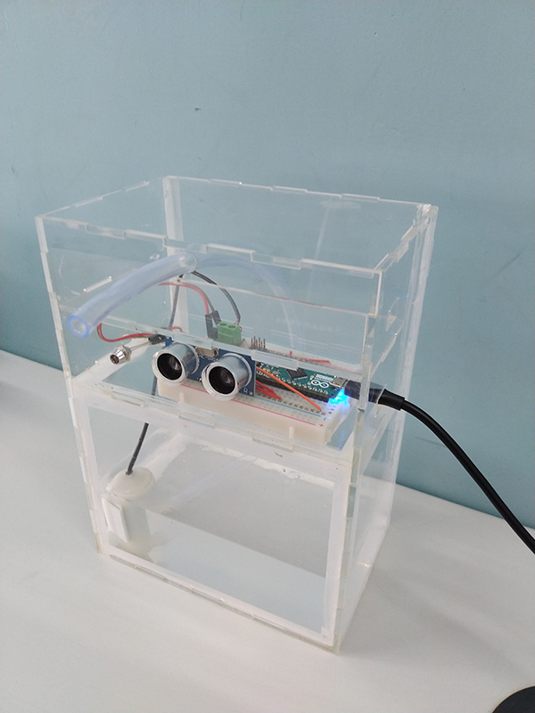

# arduino-hand-sanitizer

A simple Aurduino powered auto hand sanitizer dispenser

Laser cutting schematic for 3mm acrylic is included.

## Parts list

* Arduino micro
* LED
* Ultrasonic HC-SR04 sensor
* 5v Submersible pump - [adafruit](https://www.adafruit.com/product/4546) or [dx](https://www.dx.com/p/zhaoyao-submersible-water-pump-mini-dc3-5v-100l-h-silent-aquarium-fish-tank-accessories-2pcs-2039803.html)
* Plastic tubing
* An unlimited supply of hand sanitizer

## Tip

The viscosity of your hand sanitizer is important. The pump I used is not very powerful. It didn't work with the thick, gel-like sanitizer I had to ensure it was more fluid like.

